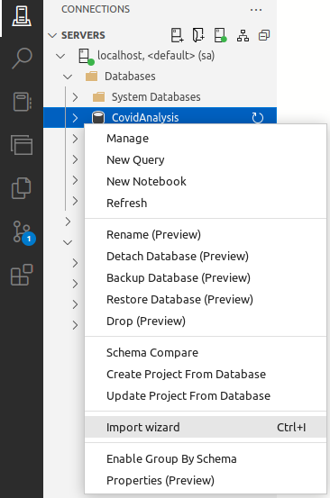
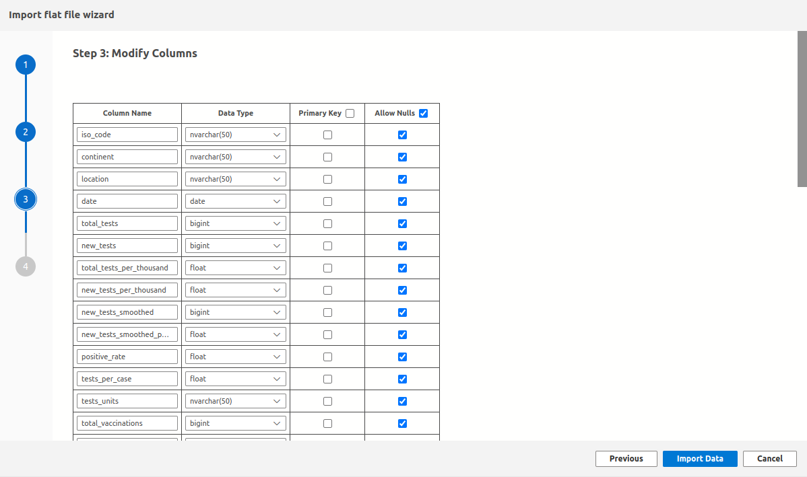

# Colombia COVID Analysis

## Description
The goal of this project is to conduct a COVID-19 analysis in Colombia using the *COVID-19 Dataset* to demonstrate proficiency in SQL and data visualization. The dataset is intentionally split to facilitate SQL JOIN operations, resulting in two tables: *CovidDeaths* and *CovidVaccinations*. Several questions were posed to be answered using SQL queries. The technologies used for this project include *SQL Server* as the RDBMS (Relational Database Management System), *Azure Data Studio* for importing data into the database and writing queries, and *Tableau* for data visualization.


## Table of Contents
- [Description](#description)
- [How to Insert the Data into Azure Data Studio](#how-to-insert-the-data-into-azure-data-studio)
  - [Prerequisites](#prerequisites)
  - [Steps](#steps)
- [Data Visualization Link](#data-visualization-link)
- [License](#license)
- [Contact Information](#contact-information)

## How to Insert the Data into *Azure Data Studio*
### Prerequisites
- **SQL Server**: Ensure SQL Server is installed on your machine.
- **Azure Data Studio**: Download and install it from [Azure Data Studio](https://docs.microsoft.com/en-us/sql/azure-data-studio/download-azure-data-studio).

### Steps
1. Clone the repository:
    ```bash
    git clone https://github.com/jaguzmana/colombia-covid-analysis.git
    ```
2. Import the dataset into SQL Server using Azure Data Studio:
    - Open Azure Data Studio and connect to your SQL Server instance.
    - Create a database using this query:
        ```sql
        USE master;
        GO
        -- Create the new database if it does not already exist
        IF NOT EXISTS (
            SELECT [name]
            FROM sys.databases
            WHERE [name] = N'CovidAnalysis'
        )
        CREATE DATABASE CovidAnalysis;
        GO
        ```
    - Install the *SQL Server Import* extension.
    - Right-click the database and select the *Import Wizard* option.

        
    
    - Fill in the required information and click *Next*.

        
    
    - Preview the data columns and click *Next*.

        

    - Specify the data type for each column and click *Next*.

        
    
    - Wait for the process to complete and then click *Done*.

        

3. Explore the queries in the `SQLQueries.sql` file.

## Data Visualization Link
[Colombia COVID Analysis Dashboard on Tableau](https://public.tableau.com/views/ColombiaCOVIDAnalysis/Dashboard1?:language=en-US&:sid=&:display_count=n&:origin=viz_share_link)

## License
This project is licensed under the MIT License - see the [LICENSE](LICENSE) file for details.

## Contact Information
For questions or support, please open an issue in the [GitHub repository](https://github.com/jaguzmana/colombia-covid-analysis/issues) or reach out via [Twitter (now X)](https://x.com/jaguzmana_).